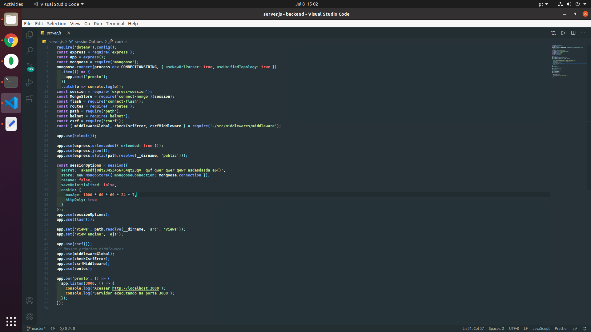

# my-setup-linux
Nodejs, vscode and more...

Esse repositório contém meu setup de ferramentas para instalar no Ubuntu 19+

## Issues

  - [Node JS](https://nodejs.org/en/)
  - [Git](https://git-scm.com/download/linux)
  - [Visual Studio Code](https://code.visualstudio.com/)
  - [React](https://pt-br.reactjs.org/)

### **Instalação NodeJS 12+ Ubuntu 19**

- curl -sL https://deb.nodesource.com/setup_12.x | sudo -E bash -
- sudo apt-get install -y nodejs

### ** Instalação do git**

- sudo apt-get install git

### **Instalação do Visual Studio Code**

- code.visualstudio.com/docs/?dv=linux64_deb

### **Extensões Visual Studio Code**
- code runner
- ESLint
- Live Sass Compiler
- Live server
- Simple React Snnipets
- Beautify
- Javascript (ES6) Code Snippets
- Markdown All in One
- Material Icon Theme
- Atom Material Theme
- Indent-Rainbow
- Auto Rename Tag
- Gitlens
- Gitblame
- Liveshare
- Vetur
- Jest Snippets
- JSX HTML <tags/> Excelente para quem usar html dentro do js com react ele reconhece as tags e completa.
- vscode-styled-components Excelente para trabalhar estilos css no react com styled-components

### **Minha configuração do vscode**
- font-weight: 900
- font-size: 14
- font-family: 'Droid Sans Mono', 'monospace', monospace, 'Droid Sans Fallback'
- tabe: 2

### Fish Shell
- https://fishshell.com/
- 

### **Instalação do pacote React globalmente**

- sudo npm install -g create-react-app  

### **Instalação do pacote react router**
- npm i react-router-dom

### **Instalação do Insomnia**
- https://insomnia.rest/download/core/?

### **Instalação do MongoDB Compass gerenciador gráfico da database mongodb**
- https://www.mongodb.com/try/download/compass
